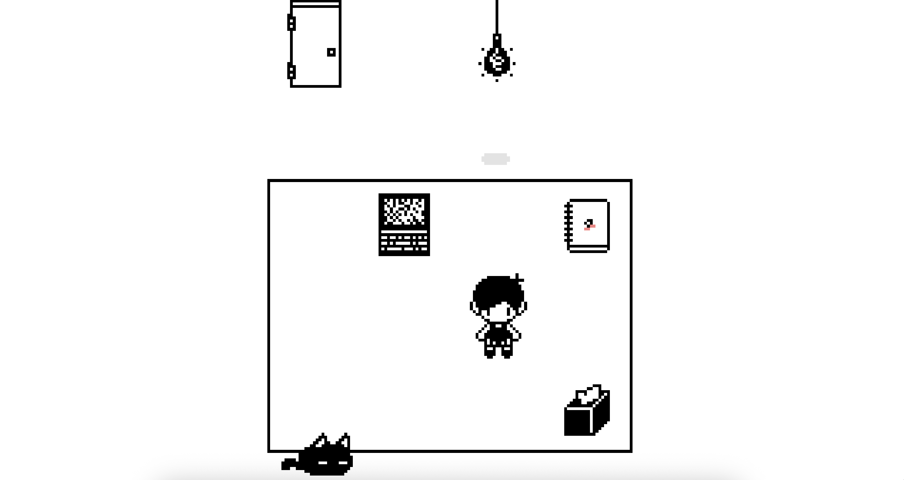
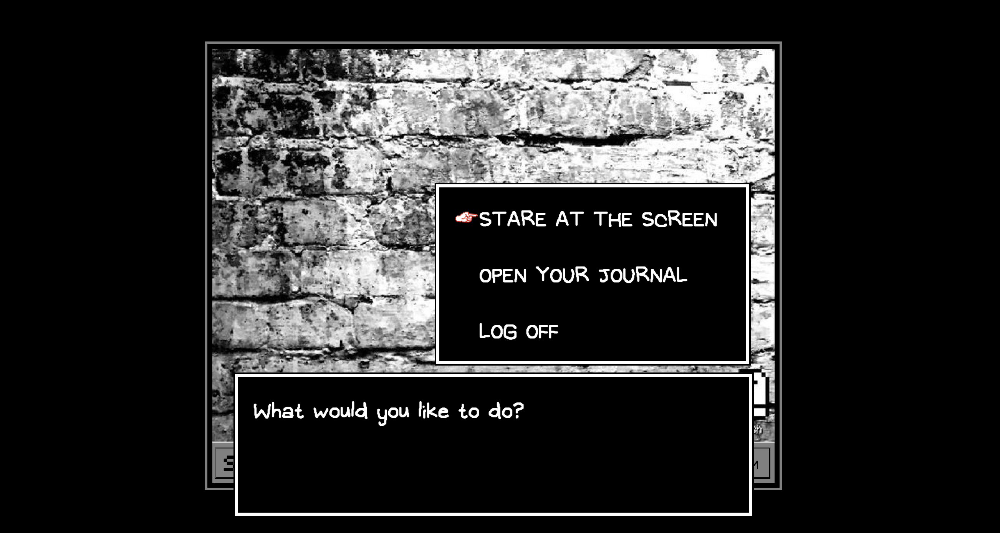
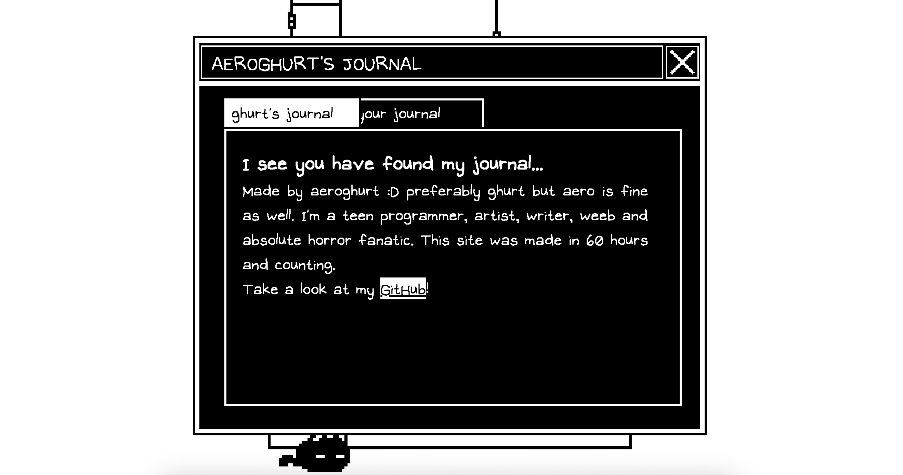
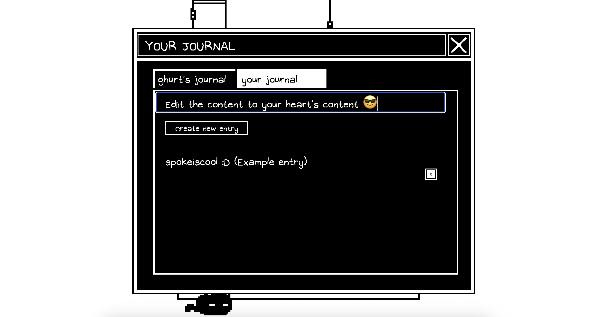
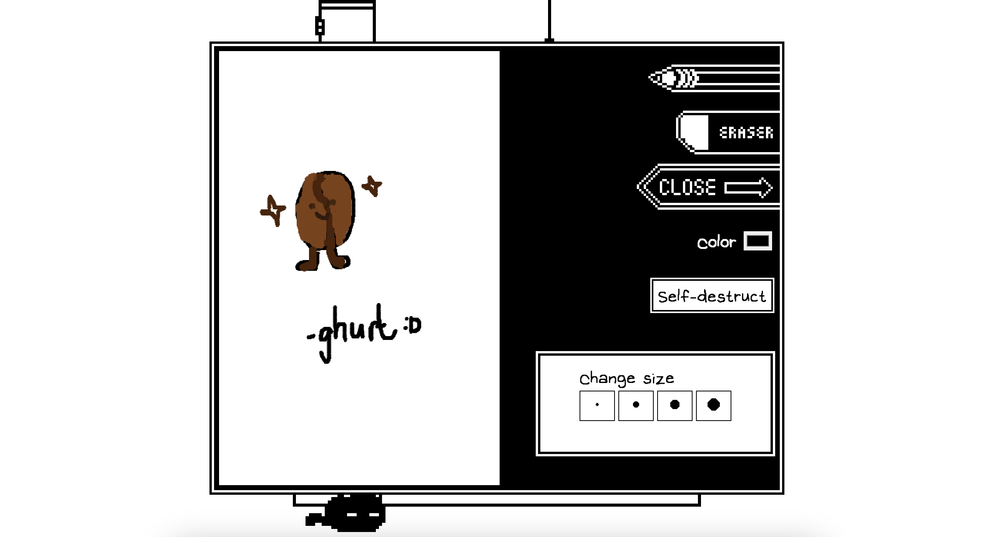
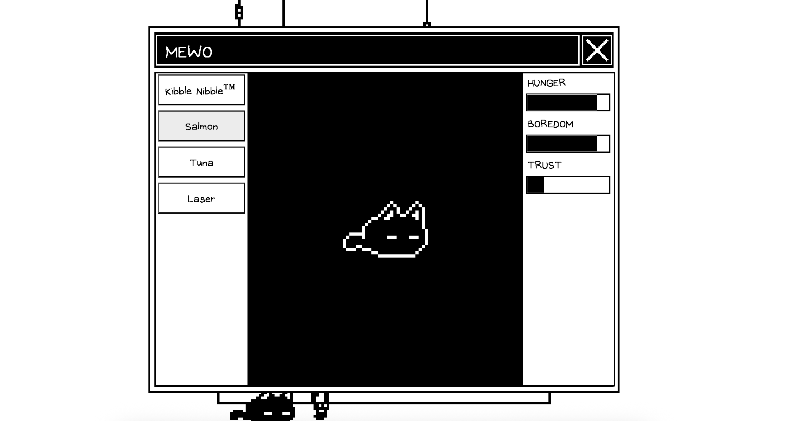

# OmoriOS

OmoriOS is a webOS heavily inspired by the game Omori. This project is by no means a one-on-one replica (and by replica I only mean of White Space TT), but I did try my best to encapsulate the feel of it. There are games, there are functioning web apps, and most importantly -- there is Mewo.

## Inspiration

I thought it would be pretty cool to not only have a webOS, but also have a character walking around to interact with web apps RPG-style. And since my other project was based off of Verity™, I realised it would be cool to have an Omori-themed one (the Omori obsession never ends, huh).

## How to run
Right here: https://aeroghurt.github.io/omori-os/

## How To Interact

Movement: use WASD (not arrow keys!! Not like the original game)
Interact: press Z to interact with objects, arrow keys to pick options, and Z again to select said options
(Warning: there may be bugs if you press the arrow keys when not intended, sorry about that. Just refresh if said bugs do happen, thanks.)

## Features

### Journal
Write your *own* journal in the webOS's built-in text editor (of some sorts). It utilises localStorage to save your current and previous works.

### Mewo Pet Simulator
Pet Mewo... or something. As of now, you can feed mewo Kibble Nibbles™, tuna and salmon infinitely! But she gets hungry real fast, be warned. You may also play laser with her, she could use some anti-boredom around here. She may not look like it, but she loves being petted, click on her and watch her lower her guard.

### Sketchbook
Draw! Or not. Change the brush and eraser sizes, pick any colour imaginable, and draw to your heart's content! ... Or not. (This sketchbook also supports self-destruction.)

### Windows are draggable!
To declutter your web desktop however you want :D!

### Random jumpscare(s) somewhere
That's it. You've been warned.

### Screenshots:
When starting:

Opening up laptop screen:

Journal 1/2:

Journal 2/2:

~The pinnacle of art~ Sketchbook:

Mewo pet simulator:
